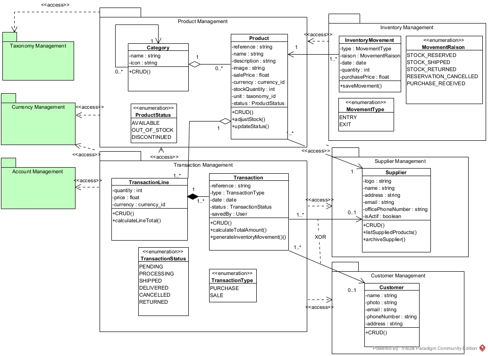

# FSMicroGenerator vs. Manual Implementation: Case Study Code Artifacts

>  This repository hosts the implementation artifacts supporting our comparative case study on automated full-stack development.  
>  The study is detailed in the manuscript *"Microservices-Driven Automation in Full-Stack Development: Bridging Efficiency and Innovation with the FSMicroGenerator"*, currently under review for publication in *IEEE Access*.
>  DOI and final reference will be updated upon publication.

**Please Note:** This repository **does not** contain the source code for the FSMicroGenerator tool itself. It provides the resulting code from the two development approaches compared in the paper.

---

## 📖 Overview

Modern web application development faces significant challenges, including complex architectures, scalability demands, rapid time-to-market requirements, and talent shortages. FSMicroGenerator addresses these issues by providing a low-code solution that leverages UML class diagrams and customizable templates to automatically generate multilingual, full-stack web applications based on a microservices architecture. It aims to automate the entire IT solution creation process, from development to deployment, reducing technical barriers and debt, enabling teams to focus on business innovation while adhering to industry best practices and DevSecOps principles.

## 📖 Overview of the Case Study: FSMicroGenerator vs. Manual Implementation

Our research, includes an experimental comparative case study to rigorously assess the impact of FSMicroGenerator on development outcomes compared to traditional manual implementation.

### 🎯 Objective

The primary goal was to evaluate FSMicroGenerator's effectiveness in terms of **development efficiency**, **code quality**, **system performance**, and **resource utilization** when building a full-stack microservices application, contrasting it with a standard manual development process under controlled conditions.

### ⚙️ Methodology

*   **Case Study:** Development of a representative **inventory management system** based on a predefined UML class diagram, as shown in Figure 1.
 

  

<em>Figure 1 – UML class diagram of the inventory management case study used in the experimental evaluation.</em>

*   **Approaches Compared:**
    1.  **FSMicroGenerator-based Implementation:** A team of **two junior developers** (1-2 years experience) used the tool.
    2.  **Manual Implementation:** A team of **five developers** (2-3 years experience) built the system manually.
*   **Environment:** Both teams used the same **MEAN technology stack**, server infrastructure, and worked under a strict **8-hour time limit**.
*   **Metrics:** A comprehensive set of quantitative and qualitative metrics were used:
    *   *Quantitative:* Functional/Non-functional requirement coverage (%), Development time (hrs), Manual interventions (commits, file modifications), Lines of Code (LOC), Scalability & Performance (throughput, latency, error rate via Apache JMeter), Resource Usage (CPU/RAM via Docker stats).
    *   *Qualitative:* Architectural modularity, Code reusability, Clarity/Consistency/Standards conformance, Maintainability (assessed by two independent experts using a predefined rubric).
*   **Normalization:** Due to the manual team achieving only partial completion (61% functional, 33% non-functional) within the time limit, relevant quantitative metrics for the manual approach were **normalized** using coverage ratios to estimate the values expected at full scope, enabling a more meaningful comparison.

*(Note: The study acknowledges threats to validity, including the asymmetric team composition and normalization assumptions. See Section V-E of the paper for details.)*

### 📊 Key Results

The study yielded significant findings highlighting the advantages of using FSMicroGenerator:

*   🚀 **Completion & Speed:** The FSMicroGenerator team achieved **100% functional and non-functional coverage in just 3 hours**. The manual team reached only **61% functional / 33% non-functional coverage in the full 8 hours**.
*   📉 **Development Effort:** The generator significantly reduced manual effort. The generator team required far fewer commits (11 vs. 115 raw) and manual file modifications (148 vs. 1305 raw) post-initial generation. Normalized estimates suggest the manual approach would require **substantially more time (~40 hours) and manual interventions (~25,000+)** to reach full scope.
*   ⚡ **Performance & Scalability:** The FSMicroGenerator-built application demonstrated **superior performance**, handling increasing load (up to 500 concurrent users) with **higher throughput, lower latency, and fewer errors** compared to the partially completed manual version. Normalization indicated this advantage would likely persist.
*   💡 **Resource Efficiency:** The generated application consumed **less CPU and RAM** under load compared to the manual implementation, suggesting better runtime efficiency.
*   ⭐ **Code Quality & Maintainability:** Qualitative assessment by experts rated the FSMicroGenerator output **significantly higher** on **modularity**, **reusability**, **clarity/consistency**, and **maintainability** (on a 5-point scale). The generated code exhibited better structure, adherence to standards, and lower perceived technical debt.

**Conclusion:** The experimental results strongly suggest that FSMicroGenerator can dramatically accelerate full-stack microservices development, reduce manual effort, improve code quality and maintainability, and lead to more performant and resource-efficient applications, even when utilized by less experienced developers compared to a larger team performing manual implementation.

---
## 📁 Repository Content and Structure

This repository organizes the source code generated/written during the case study. You can find the code for each approach in the following directories :

*   `/fsmicrogenerator_implementation`: Contains the complete source code for the inventory management system as generated by the FSMicroGenerator tool and subsequently customized by the junior development team within the study timeframe.
*   `/manual_implementation`: Contains the source code for the inventory management system as developed manually by the experienced development team within the study timeframe.
*   `/scalability_test` :  Contains the source code used to assess the scalability and performance of both implementations under load. 

The code in these directories forms the basis for the measurements and assessments reported in the paper, particularly in Tables 2, 3, 5, 6, and 7, as well as in the corresponding analysis sections.

*(Note: For more information, see the `README.md` file provided in each directory.)*

---
## 🔬 Using This Repository

This code is provided as a reference and artifact accompanying the research paper. You can use it to:

*   Examine the structure and quality of the code produced by both approaches.
*   Understand the scope of the case study application.
*   Potentially replicate parts of the evaluation (performance tests, static analysis) if you set up the required environment (MEAN stack, Docker, etc.).

---
## 🤝 Discussion and Questions

While this repository primarily serves as a static artifact for the published research, we welcome discussion and questions related to the case study, the implementations, or the results presented in the paper.

Please feel free to open an **Issue** in this repository if you have questions or wish to discuss specific aspects of the code or the comparative analysis.

---
## 📜 License

All code within this repository corresponding to the case study implementations is made available under the **Apache License 2.0**. See the `LICENSE` file for the full license text.

---
## 📞 Contact

For specific questions about the research, please contact the corresponding author mentioned in the paper: Samira Khalfaoui (samira.khalfaoui@etu.uae.ac.ma).

