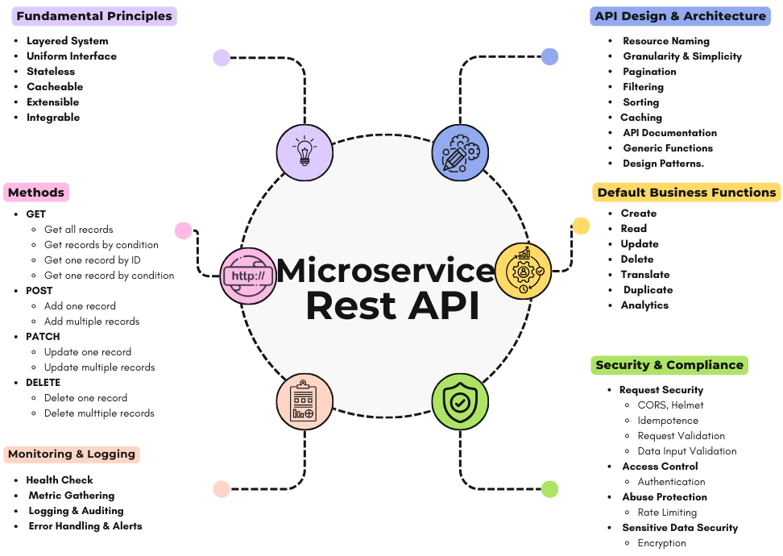

# 🚀 FSMicroGenerator: Inventory Management System

Welcome to the repository for the **Inventory Management System**, a complete application **automatically generated** by **FSMicroGenerator**! This project demonstrates the power and efficiency of FSMicroGenerator in scaffolding complex, production-ready, multilingual, full-stack applications based on microservices architecture.

FSMicroGenerator is designed to accelerate development by automating the creation of robust backend services, a feature-rich frontend, and essential operational infrastructure. This allows you as a developer to focus on core business logic rather than repetitive boilerplate code. This generated system exemplifies best practices in:

*   **Microservices Architecture:** Building scalable and resilient systems.
*   **Full-Stack Development:** Covering frontend, backend, and database interactions.
*   **Integrated Non-Functional Requirements:** Incorporating security, monitoring, caching, and more from the start.
*   **DevOps Enablement:** Providing ready-to-use Docker configurations and CI/CD pipelines.

Explore this repository to see how FSMicroGenerator translates high-level requirements into a functional, maintainable, and professional-grade application.

## 📈 Built-in Business Functionalities

FSMicroGenerator goes beyond basic scaffolding by embedding a rich set of pre-built business functionalities designed to accelerate development and ensure consistency:

*   **Automated CRUD Operations:** Standardized and validated Create, Read, Update, Delete operations are automatically generated for core entities, eliminating repetitive manual coding, ensuring homogeneity, and improving maintainability.
*   **Advanced Data Management:**
    *   **Entity Cloning:** Support for easily duplicating entities, useful for managing variants or templates.
    *   **Sophisticated Search & Filtering:** Pre-integrated capabilities for complex data querying.
*   **Multilingual Support:** Centralized internationalization (i18n) for both static UI elements (labels, menus) and dynamic, translatable entity data.
*   **Pre-configured Core Services:** Ready-to-use modules handle common requirements:
    *   **Authentication & RBAC:** Secure user management with role-based access control.
    *   **Dynamic Menu Management:** Allows runtime configuration of application navigation.
*   **Decision Support & Integration Tools:**
    *   **Dynamic Dashboards:** Capabilities for generating insightful data visualizations.
    *   **Reporting:** Tools for creating business reports.
    *   **Data Import/Export:** Facilitates seamless integration with other systems.

By automating these essential features, FSMicroGenerator allows you to focus your efforts on unique business logic and strategic differentiators.

## 🏗️ Architecture Overview

This application employs a modern **Microservices Architecture**, ensuring high cohesion, loose coupling, and independent scalability of different business domains. Figure 1 offers a high-level view of the generated solutions, summarizing the main components and their interactions. The key components include:

<p align="center">
  
</p>
<p align="center"><em>Figure 1 – Architecture of the generated solution.</em></p>

*   **Frontend:** A dynamic Single Page Application (SPA) built with Angular and PrimeNG.
*   **Backend Microservices:** Independent Node.js/Express.js services, each managing a specific domain and its own MongoDB database.
*   **API Gateway:** A custom-built gateway using Express.js/Node.js, acting as the single entry point. It handles:
    *   **Service Registry:** For dynamic microservice management.
    *   **Reverse Proxy & Routing:** Directing requests to the appropriate backend microservice.
    *   **Load Balancing:** Distributing incoming traffic for optimal performance.
    *   **Cross-Cutting Concerns:** Centralizing aspects like initial authentication, authorization, and rate limiting.
*   **Databases:** Dedicated MongoDB instances per microservice ensure data isolation.
*   **Caching Layer:** Redis provides efficient caching (e.g., for frequent API responses).
*   **Communication Bus:** RabbitMQ enables asynchronous, event-driven communication between services.
*   **Monitoring Stack:** Prometheus collects metrics, and Grafana provides visualization dashboards.
*   **Containerization:** The entire stack is containerized using Docker and orchestrated via Docker Compose.
*   **Core Support Services:** FSMicroGenerator also provides ready-to-use essential services:
    *   **Account Management:** Handles users, roles, permissions (RBAC), and authentication.
    *   **Technical Configuration:** Manages dynamic menus and internationalization settings.
    *   **Taxonomy:** Structures and classifies content.


## ✨ Fundamental Principles

This generated application adheres to core design principles:

*   **Microservices & Domain-Driven Design (DDD):** Services are decomposed around specific business domains.
*   **RESTful APIs:** Backend services expose APIs following REST principles (See Figure 2).
*   **Asynchronous & Synchronous Communication:** Uses RabbitMQ for both event-driven (Pub/Sub) and request/reply (RPC) patterns.
*   **Separation of Concerns:** Clear distinction between frontend, backend, gateway, and infrastructure.
*   **Configuration Management:** Global and service-specific configuration handling.
*   **Containerization:** Encapsulating services using Docker.

<p align="center">
  
</p>
<p align="center"><em>Figure 2 – Key principles and best practices driving our approach to designing RESTful microservices APIs.</em></p>

## 🛠️ Technology Stack

*   **Frontend:** Angular, TypeScript, PrimeNG (UI Components)
*   **Backend Microservices:** Node.js, Express.js
*   **Database:** MongoDB
*   **API Gateway:** Custom Express.js / Node.js
*   **Caching:** Redis
*   **Message Broker:** RabbitMQ
*   **API Documentation:** Swagger / OpenAPI (Auto-generated per service)
*   **Validation:** Joi (Server-side), Angular Reactive Forms (Client-side)
*   **File Uploads:** Multer
*   **Logging:** Winston
*   **Monitoring:** Prometheus, Grafana
*   **Containerization:** Docker, Docker Compose
*   **CI/CD:** GitLab CI

## ⚙️ Key Cross-Cutting Features

FSMicroGenerator automatically integrates essential non-functional requirements:

*   **🛡️ Security:**
    *   **Authentication & Authorization (RBAC):** Secure endpoints using JWT and Role-Based Access Control.
    *   **Rate Limiting:** Protects APIs from abuse (implemented at Gateway and/or service level).
    *   **Input Validation:** Rigorous server-side (Joi) and client-side (Angular Forms) validation.
    *   **Basic Security Headers:** Includes Helmet and CORS configuration.
*   **💾 Caching:** Redis integration for performance optimization.
*   **↔️ Inter-Service Communication:** Supports both asynchronous messaging (RabbitMQ Pub/Sub) and synchronous request/reply (RabbitMQ RPC).
*   **🌐 Internationalisation (i18n):**
    *   **Static Content:** Frontend supports multiple languages (EN 🇬🇧, FR 🇫🇷, AR 🇸🇦) via i18n JSON files.
    *   **Dynamic Data:** A dedicated approach allows translatable dynamic data content.
*   **📜 Centralised Logging:** Structured logging using Winston.
*   **📊 Monitoring & Alerting:** Services expose metrics for Prometheus, visualized in Grafana.
*   **📄 API Documentation:** Auto-generated interactive Swagger/OpenAPI documentation per microservice.


## 🐳 Deployment

The application is designed for containerized deployment using Docker.

*   **Configuration:** Managed via environment files (`.env`, `.env.dev`, `.env.test`) and Docker Compose files (`docker-compose.prod.yml` for production, `docker-compose.yml` for development).
*   **Orchestration:** Docker Compose handles the setup and linking of all services.
*   **Instructions:** Refer to the Docker Compose files and environment variable templates for detailed deployment steps.

## 🦊 CI/CD Pipeline with Integrated DevSecOps (GitLab)

A robust CI/CD pipeline, defined in `.gitlab-ci.yml`, automates the build, security scanning, testing, and deployment lifecycle, embedding security practices throughout (**DevSecOps**).

**Pipeline Stages:** `install` ➔ `test` ➔ `build` ➔ `security` ➔ `deploy` ➔ `notify` ➔ `cleanup`

**Workflow:**

1.  **On Every Commit (All Branches):**
    *   `install`: Installs NPM dependencies.
    *   `test`: Executes automated tests (Jest), generating reports.
    *   `security (Partial)`: Integrates automated security scans using GitLab templates and custom tools that run on all branches:
        *   **GitLab Native Scans:** SAST, Dependency Scanning, Secret Detection.
        *   **IaC Security Scan (Checkov):** Scans infrastructure-as-code files.
        *(Note: These scans provide early feedback on potential issues.)*

2.  **On Commit to `main` Branch Only:**
    *   `build`: Builds and pushes versioned Docker images to the GitLab Container Registry.
    *   `security (Container Scan)`: Performs **Container Scanning** (GitLab Template & Custom Trivy) on the newly built images to detect vulnerabilities specifically within the container environment.
    *   `deploy`: Securely connects to the remote host (SSH), pulls the built and scanned images, and restarts the application using `docker-compose.prod.yml` (with backup/rollback).
    *   `notify`: Sends Slack notifications for deployment status and critical security alerts (from *all* scans, including container scanning).
    *   `cleanup`: Periodically removes old containers/images on the remote server.

**DevSecOps Highlights:**

*   🔒 **Continuous Security:** Security scans (SAST, Dependency, Secret, IaC) run on *every commit* for early feedback.
*   🛡️ **Pre-Deployment Gate:** Container scanning runs specifically on the `main` branch *after build* but *before deployment*, acting as a crucial check on the final artifacts.
*   🔑 **Comprehensive Scanning:** Covers static code, dependencies, secrets, infrastructure configuration, and container images.
*   📢 **Integrated Alerting:** Immediate Slack notifications for critical security findings from any scan stage.


## ⚡ Getting Started

Two primary methods exist for running this project locally:

**Option 1: Docker Compose (Recommended)**

*   **Prerequisites:** Docker and Docker Compose installed.
*   **Configuration:** Review/create `.env` files for different environments (`.env`, `.env.dev`, `.env.test`). Pay attention to production settings in `docker-compose.prod.yml`.
*   **Run:** Use Docker Compose to build and start all services. For production:
    ```bash
    # Ensure you have configured .env
    docker-compose -f docker-compose.prod.yml up --build -d
    ```

**Option 2: Local Services (Manual Setup)**

*   **Prerequisites:**
    *   Node.js (v >= 18)
    *   Angular CLI (v >= 17)
    *   MongoDB (v >= 5)
    *   Redis
    *   RabbitMQ
    *   (Optional) Grafana/Prometheus for monitoring.
*   **Run Script:** Use the `runServices.sh` script. This script typically installs dependencies for each component (API Gateway, backend microservices, frontend) and runs them in development mode.
    ```bash
    ./runServices.sh
    ```
*   **Configuration:** Manual setup of environment variables and potentially monitoring configurations might be required.

**Accessing the Application:**

*   **Frontend:** `http://localhost:4200` (Default)
*   **Swagger UI:** `http://localhost:<service_port>/api-docs` (Per service)
*   **Health Check:** `http://localhost:<service_port>/health` (Per service)
*   **Prometheus:** `http://localhost:9090` (Default)
*   **Grafana:** `http://localhost:3000` (Default)
*   **RabbitMQ Management:** `http://localhost:15672` (Default management port)

*(Note: Check specific `docker-compose.*.yml` files or environment variables for exact ports)*

---

*This README was automatically generated by FSMicroGenerator (v1).*

---

*The following section was added manually to provide complementary instructions required for local deployment and login, in order to facilitate application testing and ensure the reproducibility of the comparative study described in the paper.*


## 🔐 Permissions Notice (for local deployment)

If you plan to run the application locally, make sure to grant execution permissions to the following scripts:

```bash
chmod +x ./runServices.sh
chmod +x ./utils/database/restoredb.sh
````

Once permissions are set, you can manually execute the database import script:

```bash
./utils/database/restoredb.sh
```

> 💡 *This script restores the MongoDB database automatically generated by FSMicroGenerator. It should be executed before running the app if you want to start with preloaded data.*

## 🔑 Default Login Credentials

To access the generated application locally, use the following default credentials:

* **Email**: `email@gmail.com`
* **Password**: `Password331`

These credentials are provided solely for demonstration and evaluation purposes.

---

*If you encounter difficulties setting up the project or require further information, please contact us:*
📧 **Email**: [samira.khalfaoui@etu.uae.ac.ma](mailto:samira.khalfaoui@etu.uae.ac.ma)